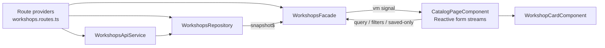
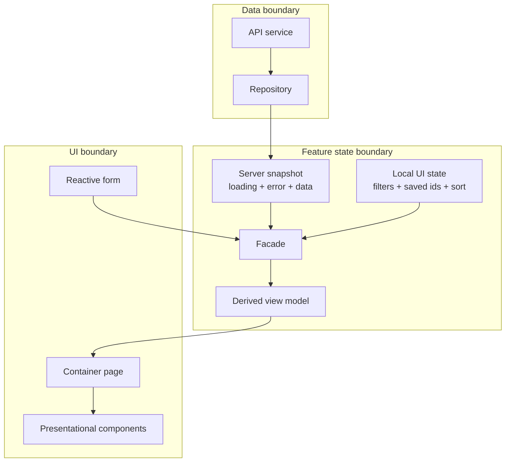

# Angular Architecture Lab

This project is a training workspace for learning modern Angular architecture with a strong RxJS focus.

It is intentionally **not** a beginner Angular tutorial. This lab is for developers who already know Angular basics and want to practice stronger architectural decisions, clearer boundaries, and more scalable feature design.

The codebase is intentionally organized around a few patterns you will see in larger Angular applications and in teams that care about long-term maintainability:

- route-level feature providers to keep dependencies scoped to a feature
- a repository layer that owns async data loading and caching
- a facade layer that turns events and server snapshots into a view model
- presentational components that stay dumb and receive inputs or emit events
- reactive forms wired to RxJS streams instead of ad hoc event handlers

## Who This Is For

This repo is best used when you want to learn or compare:

- Angular architectural best practices
- feature boundaries and dependency scoping
- repository and facade design
- RxJS-driven state flows
- signals and RxJS working together
- tradeoffs between simpler and more layered designs

This repo is **not** aimed at teaching:

- Angular basics
- TypeScript basics
- template syntax fundamentals
- the first steps of reactive forms or routing

If you are already comfortable building Angular features and want to sharpen your architectural judgment, this lab is the right fit.

## Run It

```bash
npm install
npm start
```

`npm start` now launches both the Angular dev server and the Express API. The app runs on
`http://localhost:4200` and proxies `/api/*` requests to the configured Express port.

By default the API runs on `3001`. To override it for both the server and Angular proxy, set
`API_PORT` before starting the app:

```bash
API_PORT=3100 npm start
```

## Angular MCP

This repo includes project-local Angular CLI MCP configuration for editors that support checked-in
MCP files:

- Cursor: `.cursor/mcp.json`
- VS Code: `.vscode/mcp.json`

Both use Angular's official CLI MCP server:

```json
{
  "command": "npx",
  "args": ["-y", "@angular/cli", "mcp"]
}
```

If you use IntelliJ IDEA or WebStorm, Angular documents JetBrains MCP setup under
`Settings | Tools | AI Assistant | Model Context Protocol (MCP)`. Add a server there with the
same `npx -y @angular/cli mcp` command.

## Build It

```bash
npm run build
```

The production output is written to `dist/angular-architecture-lab`.

## Architecture Map

- `src/app/core/layout`: app shell and top-level navigation
- `src/app/features/workshops`: the main learning feature with facade, repository, routes, and UI components
- `src/app/features/dashboard-composition`: a composed dashboard that merges three repository snapshots into one route-level view model
- `src/app/features/enrollment-effects`: a feature that models separate intent streams, API effects, and reducer events
- `src/app/features/optimistic-updates`: a feature that demonstrates optimistic writes, server confirmation, and rollback
- `src/app/features/patterns`: a second feature page that explains the architecture decisions
- `docs/learning-path.md`: the coaching roadmap and follow-up exercises
- `docs/pattern-tradeoffs.md`: explicit pattern tradeoffs, usage guidance, and architecture diagrams

## Visual Architecture

### Workshops feature



### Responsibility boundaries



## Pattern Tradeoffs

This repo intentionally teaches several patterns, but they are not meant to be universal defaults. The goal is to study Angular architecture and best practices with context, not to present every pattern as mandatory.

Read `docs/pattern-tradeoffs.md` for:

- when route-level providers help and when they add unnecessary setup
- when to introduce a repository and when direct data access is enough
- when a facade clarifies the feature and when it becomes indirection
- why this repo prefers snapshot streams over separate loading/data/error streams
- how to think about signals vs RxJS responsibilities

## Suggested Study Order

1. Start in `src/app/app.routes.ts` and `src/app/core/layout`.
2. Read the diagrams and tradeoffs in `docs/pattern-tradeoffs.md`.
3. Move to `src/app/features/workshops/workshops.routes.ts`.
4. Trace `WorkshopsRepository` and then `WorkshopsFacade`.
5. Inspect how `CatalogPageComponent` turns form control streams into facade updates.
6. Extend the feature by adding another filter, command, or derived view model.

## First Exercises

1. Add a new `deliveryMode` filter from end to end.
2. Persist saved workshops in local storage without leaking that concern into the UI.
3. Replace the mock API with a real HTTP endpoint and keep the facade unchanged.
4. Add optimistic updates for enrollment requests and reason about rollback behavior.

## Future Learning Features

These are good candidates for separate features so the repo can keep teaching one architectural pressure at a time.

- `draft-editor`: local component state vs facade state vs persisted state, plus autosave, dirty tracking, and navigation guards.
- `polling-and-staleness`: refresh intervals, stale banners, cache age, and background revalidation.
- `master-detail-selection`: URL state vs UI selection state vs feature state.
- `wizard-flow`: multi-step route-scoped state, validation, progress, and resumable drafts.
- `permissions-aware-feature`: role and capability-based UI composition without leaking auth logic into every component.
- `realtime-feed`: merging server-push events with user commands while handling ordering and idempotency.
- `offline-queue`: queued writes, retries, backoff, and sync status.
- `plugin-style-feature-shell`: extension points, feature registration, and isolating feature ownership behind contracts.

Suggested next order:

1. `draft-editor`
2. `polling-and-staleness`
3. `master-detail-selection`
