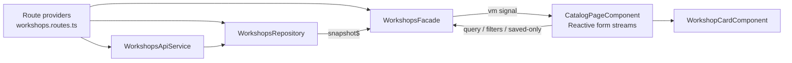
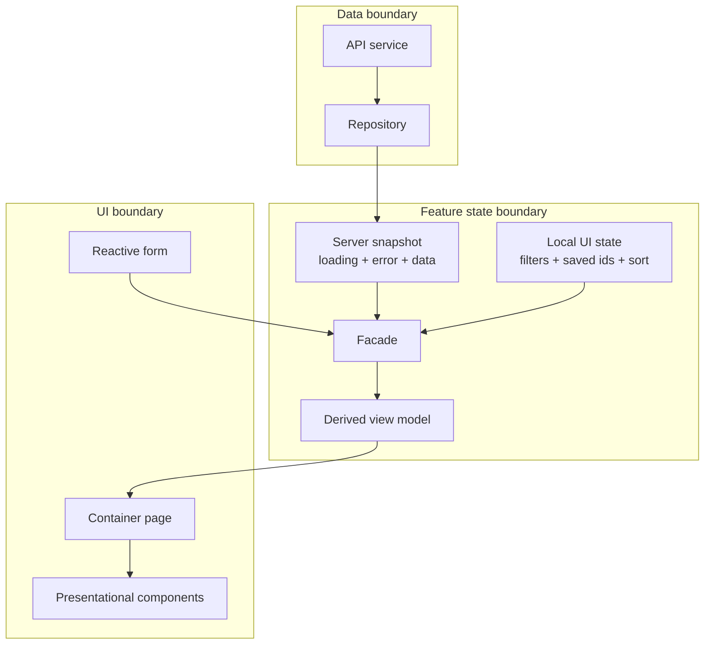

# Pattern Tradeoffs

This repo is opinionated on purpose, but the patterns here are not meant to be used everywhere.

This is not a beginner Angular document. It is written for developers who already know Angular fundamentals and want to understand architectural best practices, design tradeoffs, and how to choose between simpler and more layered approaches.

Use this document to understand why a pattern exists, what problem it solves, and when it becomes unnecessary overhead.

## Visual Architecture: Workshops Feature

## Visual Architecture: Repository and Facade Responsibilities

## Route-Level Feature Providers

### Why use them

- Keep dependencies scoped to the feature route.
- Make it obvious which services belong to a feature.
- Prevent app-wide singletons when the state should reset on navigation.
- Improve teachability because the route becomes the feature composition root.

### Tradeoffs

**Pros**
- Better feature isolation.
- Easier to reason about ownership.
- Less accidental shared state across unrelated pages.

**Cons**
- More setup than just using `providedIn: 'root'`.
- Can surprise developers who expect state to survive route changes.
- Shared cross-feature state needs a different home.

### Use it when

- The service is truly feature-local.
- You want state to be recreated when the route is recreated.
- You want the route config to document the feature’s dependencies.

### Avoid it when

- The state must persist across the whole app.
- Multiple unrelated features need the same long-lived service.
- The feature is so small that route-scoped composition adds more ceremony than value.

## Repository Pattern

In this repo, the repository owns loading, refresh triggers, error handling, and the stable server snapshot.

### Why use it

- Keep fetch and caching logic out of components.
- Give the rest of the feature one stable contract.
- Hide whether the data came from HTTP, memory cache, polling, or another source.

### Tradeoffs

**Pros**
- Components and facades stay focused on UI concerns.
- Easier to swap backend details later.
- A snapshot model is easier to consume than several loosely related streams.

**Cons**
- Adds another abstraction layer.
- Can become a thin wrapper over `HttpClient` if the feature is trivial.
- Teams sometimes over-generalize repositories into generic CRUD wrappers that teach nothing.

### Use it when

- You have refresh logic, caching, retry, polling, composition, or async state transitions.
- Multiple consumers need the same server-backed state.
- You want a stable data boundary between backend concerns and UI concerns.

### Avoid it when

- The feature performs a single request with no reuse or lifecycle complexity.
- A simple route resolver or one small component-level stream is enough.
- The repository would only rename `http.get()` and add no meaningful boundary.

## Snapshot Stream Instead of Separate Loading/Data/Error Streams

This repo prefers one object like `{ loading, error, workshops }`.

### Why use it

- Consumers subscribe to one coherent state shape.
- Loading and error transitions stay aligned with the data they describe.
- View models become easier to derive.

### Tradeoffs

**Pros**
- Easier to bind in templates and convert to signals.
- Fewer synchronization bugs than separate streams.
- Better for teaching reducer-style thinking.

**Cons**
- Can feel verbose compared to exposing raw data only.
- Frequent object recreation can feel heavier, even if it is usually fine.
- Some developers prefer smaller streams for composability.

### Use it when

- The UI always needs loading, error, and data together.
- You want a stable feature contract.
- You want state transitions to be explicit.

### Avoid it when

- Consumers truly need only a single primitive stream.
- The additional state shape adds noise without helping coordination.

## Facade Pattern

In this repo, the facade combines repository snapshots and local UI mutations into a view model.

### Why use it

- Give the UI a small API: commands in, view model out.
- Keep derivation and filtering logic out of templates.
- Separate backend state from local UI state.

### Tradeoffs

**Pros**
- Components become simpler and easier to test.
- Derivations live in one place.
- The feature gets a clear API boundary.

**Cons**
- Another layer to navigate.
- Can become unnecessary indirection for tiny features.
- Poorly designed facades can become “god services” that do everything.

### Use it when

- The feature has multiple UI inputs and multiple derived outputs.
- You need to merge server state with local state.
- You want a stable surface for container components.

### Avoid it when

- The component is small and has little derivation logic.
- The facade would only forward fields and methods without adding clarity.

## Presentational Components

### Why use them

- Keep leaf components focused on display and emitted events.
- Make reuse and testing easier.
- Reduce accidental coupling to feature services.

### Tradeoffs

**Pros**
- Clear contracts.
- Easier visual testing.
- Lower cognitive load at the leaf level.

**Cons**
- More `@Input()` and `@Output()` plumbing.
- Can feel too formal for very small apps.
- Strict separation can be awkward when a component is both UI-heavy and stateful.

### Use them when

- You want reusable UI pieces.
- You want feature state to stay in a higher layer.
- The component mainly renders data.

### Avoid them when

- The component is tiny and split costs more than it helps.
- State and rendering are inseparable for the use case.

## Reactive Forms Wired to Streams

### Why use them

- UI input changes become explicit data streams.
- Debouncing, combining, and distinct filtering become straightforward.
- Makes form-to-state flow visible and testable.

### Tradeoffs

**Pros**
- Great for search, filters, autosave, and derived state.
- Easy to combine with repository and facade patterns.
- Encourages declarative state flow.

**Cons**
- More advanced than direct event handlers.
- Can feel harder to debug for Angular beginners.
- Overusing RxJS for trivial form interactions can make the code feel ceremonial.

### Use it when

- The form drives queries, filters, drafts, or effects.
- Timing matters: debounce, throttle, combine, cancel.
- You want form behavior represented as streams rather than ad hoc callbacks.

### Avoid it when

- The form is tiny and submitted once.
- Simple template or reactive form handlers are enough.

## Signals and RxJS Together

This repo uses RxJS for async event flows and Angular signals for local synchronous state and derived view models.

### Why use both

- RxJS is strong at time-based async flows and cancellation.
- Signals are strong at synchronous state reads and template-friendly derivation.
- `toSignal()` creates a useful bridge at the feature boundary.

### Tradeoffs

**Pros**
- Each tool is used where it fits best.
- Templates can consume clean computed values.
- Async boundaries stay explicit.

**Cons**
- Learners must understand two reactivity models.
- Teams can create inconsistent style if they do not define boundaries.
- The switch from observables to signals needs intention, not habit.

### Rule of thumb for this repo

- Use **RxJS** for async events, network flows, cancellation, and effect pipelines.
- Use **signals** for local state, computed state, and template-facing view models.
- Convert at the boundary, not everywhere.

## Best Practices With Context

A core goal of this lab is to show that Angular best practices are rarely absolute rules.

A pattern becomes a best practice only when:

- it solves a real problem in the feature
- it creates a clearer ownership boundary
- it improves testability, changeability, or readability
- its added structure is justified by the feature complexity

That is why this repo does not teach "always use repositories" or "always add a facade." Instead, it teaches how to evaluate whether those choices improve the design.

## Naive Version vs Architectural Version

### Naive approach

Put `HttpClient` calls, loading flags, filters, sorting, and click handlers directly in one page component.

### Why that works sometimes

- Fast to build.
- Easy for a very small feature.
- Fewer files.

### Why this repo does more

As soon as you add refresh, caching, retry, local saved state, route reuse, optimistic updates, or multiple consumers, the “single smart component” gets noisy fast.

This repo chooses extra structure because it is trying to teach:

- state ownership
- explicit boundaries
- replaceable data sources
- testable derivations
- scaling a feature without collapsing into one giant component

## Questions to ask before adding a pattern

1. What problem does this pattern solve here?
2. What code gets simpler because of it?
3. What complexity does it add?
4. Would a smaller feature-local approach be enough?
5. Is this teaching a real boundary, or just moving code into more files?
